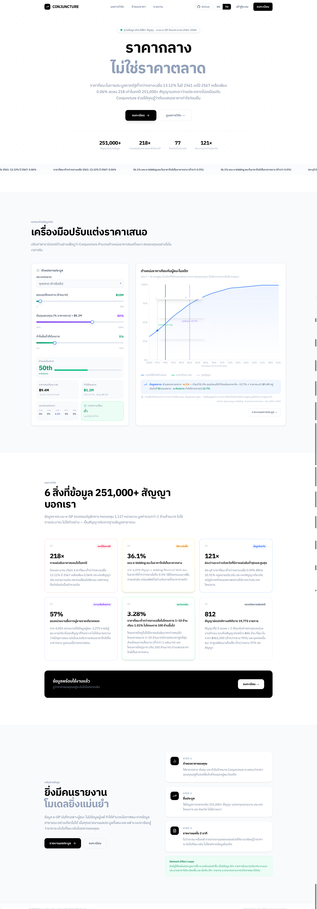
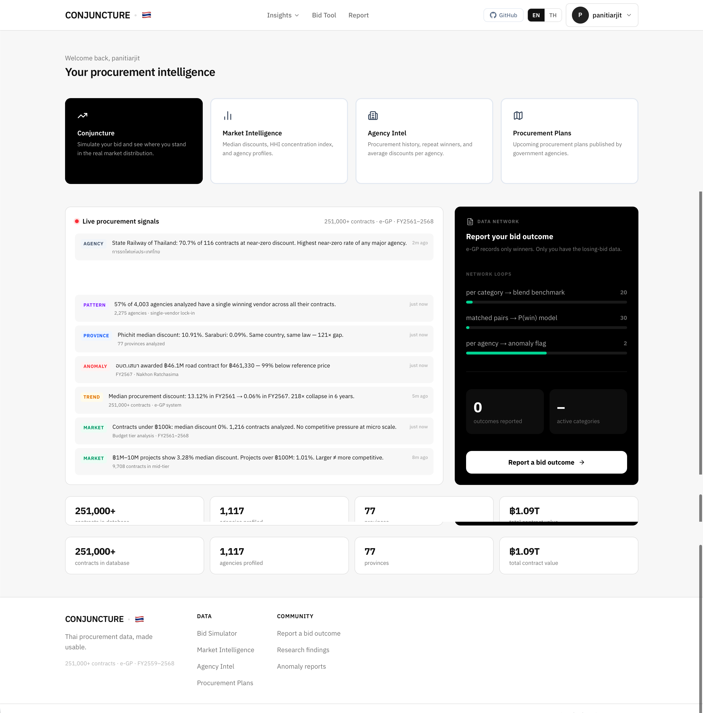
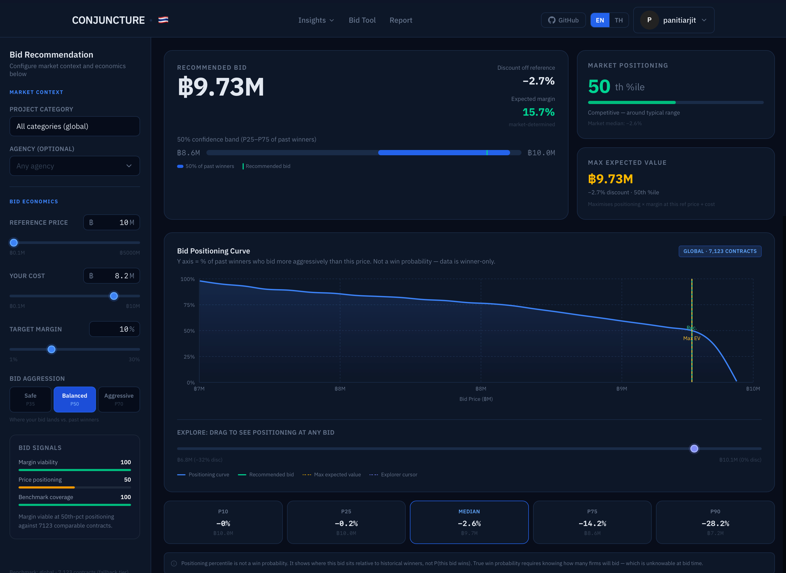
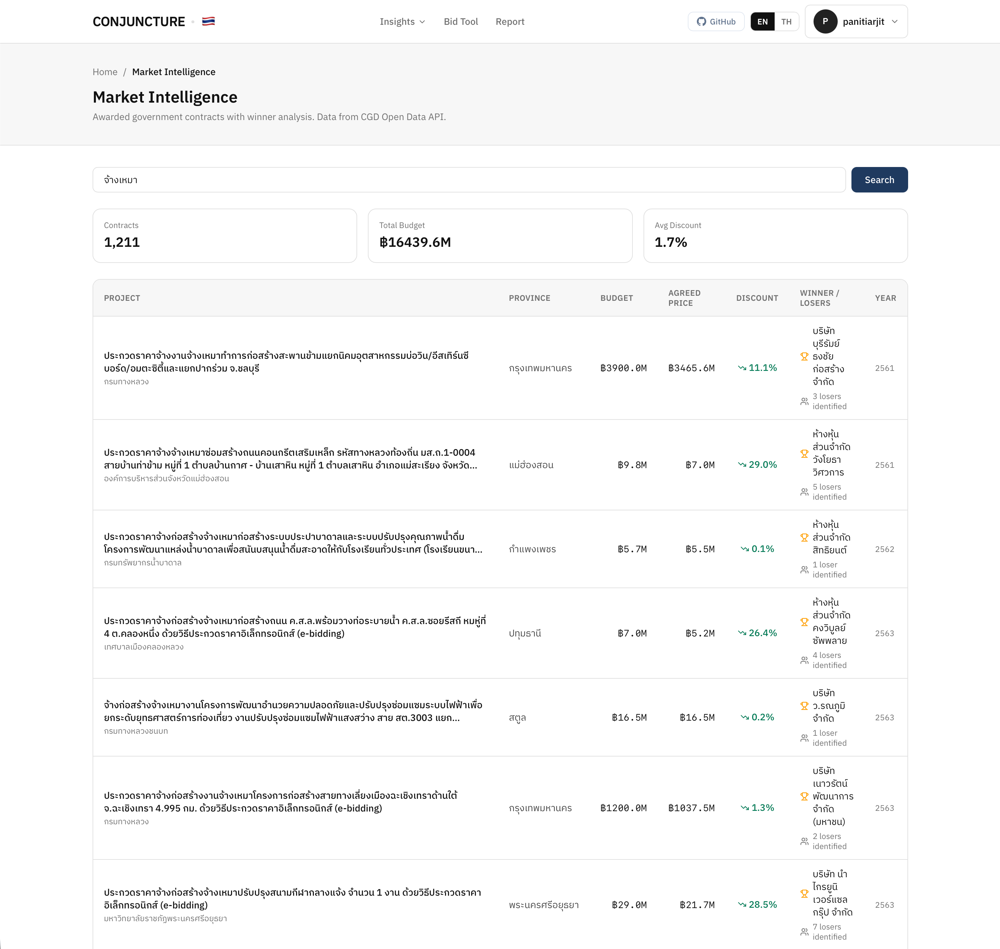
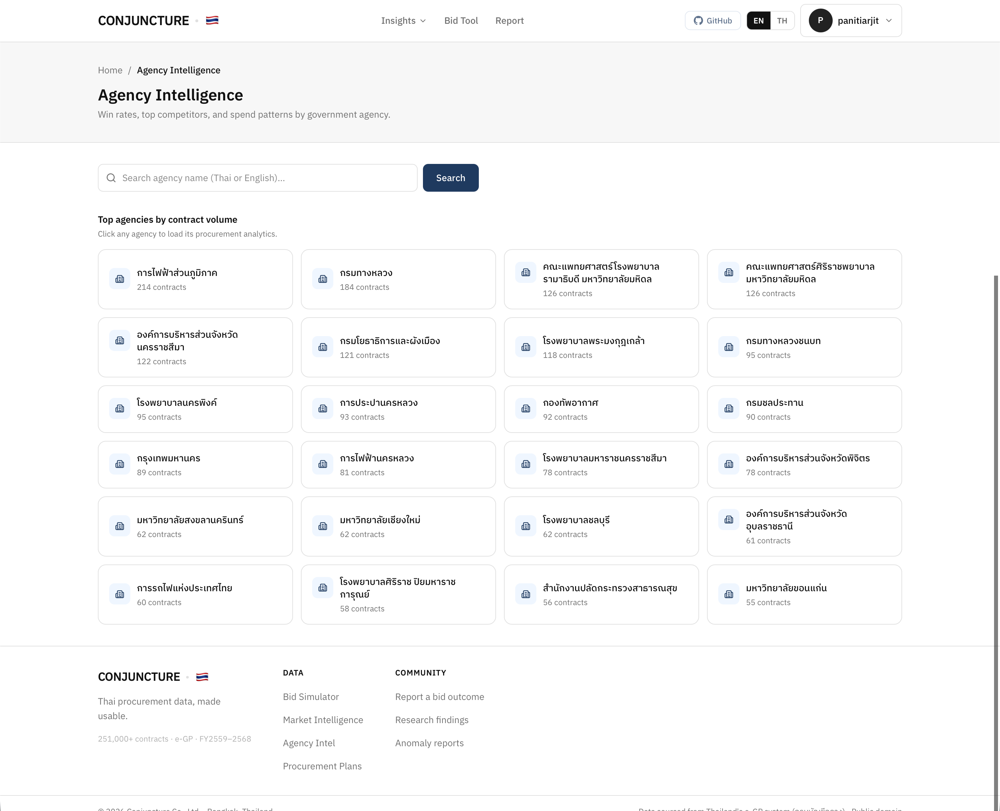
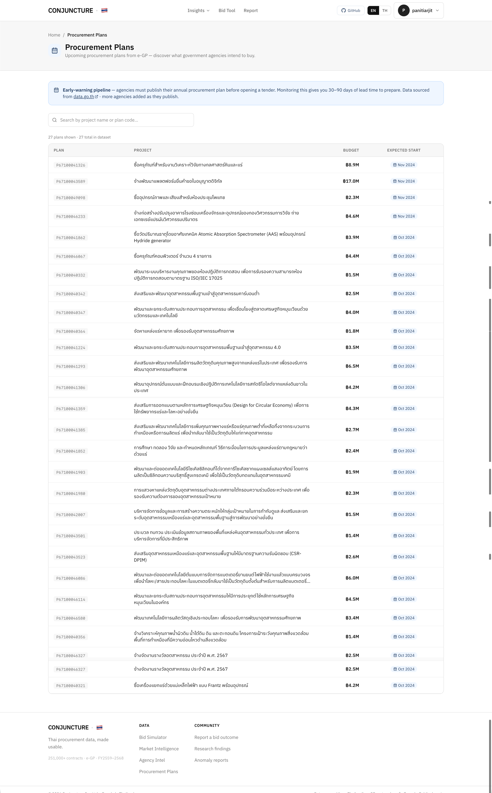
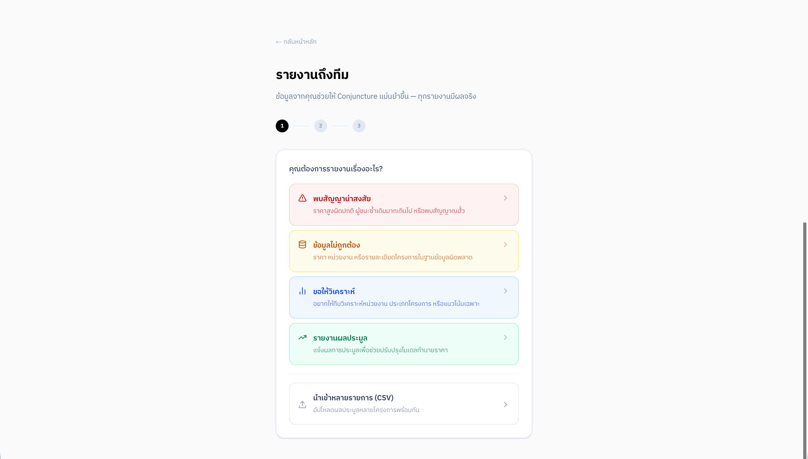

<h1 align="center">Conjuncture</h1>

<p align="center"><strong>Thai Government Procurement Intelligence · Bid Smarter, Win More</strong></p>

<p align="center">
  A real-time procurement data platform that tells you where your bid price sits in the actual market distribution — before you submit.
</p>

<p align="center">
  <a href="https://conjuncture.work"><strong>conjuncture.work →</strong></a>
</p>

<p align="center">
  
  
  
  
  
</p>

---

## 📖 Overview

Conjuncture scrapes every awarded contract from Thailand's e-GP procurement portal (กรมบัญชีกลาง) and turns the raw data into actionable market intelligence for contractors.

The Thai government publishes procurement data publicly — but it's raw XML across thousands of agencies with no aggregation, no benchmarks, and no way to compare your bid against history.

Conjuncture fixes that. 251,000+ contracts analyzed. Updated daily.

---

## 🔭 Our Vision

Procurement in Thailand has become dramatically less competitive. The median winning discount dropped from **13.12% in FY2561 to 0.06% in FY2567** — a 218× collapse in six years. Markets that look open are effectively captured.

Conjuncture is a rehearsal laboratory for contractors: run your bid price against 251,000+ historical outcomes and know your positioning before the deadline. We believe that market transparency is a public good, and that contractors who see the data win fairer.

---

## 🌐 Live Demo

Visit **[conjuncture.work](https://conjuncture.work)** to try the BidSight simulator live.

No installation required. Sign in with Google or register with email.

---

## 📸 Screenshots

**Landing page** — market context, key statistics, and call to action.



---

**Dashboard** — live procurement signals, data network loop progress, and platform-wide stats.



---

**Bid Tool** — real-time win-curve simulator with recommended bid, market positioning percentile, and max expected value.



---

**Market Intelligence** — full-text search across 251,000+ awarded contracts with winner, discount, and loser data.



---

**Agency Intelligence** — top agencies by contract volume; click any to load win rates, top competitors, and spend patterns.



---

**Procurement Plans** — upcoming e-GP procurement plans with 30–90 day lead time before tender opens.



---

**Community Report** — 3-step flow for contractors to submit suspicious patterns, data corrections, or bid outcome results.



---

## ⚙️ Workflow

1. **Data collection** — TypeScript scrapers pull e-GP tenders and awarded contracts daily; Python scrapers cover 7 SOE portals (BMA, MEA, PEA, PWA, EGAT, MRTA, PTT)
2. **Normalization** — contracts are bucketed by procurement category and budget tier into a `QuantileTable` (p10 / p25 / median / p75 / p90)
3. **BidSight model** — given your reference price, cost structure, and margin floor, computes your bid's CDF positioning and recommends the optimal discount
4. **Network Effect loops** — as community bid outcome reports accumulate, three automated loops blend behavioral data into the benchmark, fit win-probability logistic regression, and flag anomalies
5. **Live signals** — the home feed shows real-time market signals derived from the latest scrape run

---

## 🚀 Quick Start

### Prerequisites

| Requirement | Version |
|-------------|---------|
| Node.js | 18+ |
| Python | 3.11 – 3.12 |
| Firebase project | Firestore + Auth enabled |
| Resend account | For transactional email |

### Option 1 · Source Code (Recommended)

**1. Clone and install**

```bash
git clone https://github.com/panitiarjit/Conjuncture
cd Conjuncture
npm install
```

**2. Configure environment**

```bash
cp .env.local.example .env.local
```

Fill in `.env.local`:

```env
# Firebase (client-side)
NEXT_PUBLIC_FIREBASE_API_KEY=
NEXT_PUBLIC_FIREBASE_AUTH_DOMAIN=
NEXT_PUBLIC_FIREBASE_PROJECT_ID=
NEXT_PUBLIC_FIREBASE_STORAGE_BUCKET=
NEXT_PUBLIC_FIREBASE_MESSAGING_SENDER_ID=
NEXT_PUBLIC_FIREBASE_APP_ID=

# Firebase Admin (scripts only — not available on Cloudflare Workers)
FIREBASE_ADMIN_PROJECT_ID=
FIREBASE_ADMIN_CLIENT_EMAIL=
FIREBASE_ADMIN_PRIVATE_KEY=

# App
ADMIN_EMAIL=        # comma-separated admin emails
SCRAPE_SECRET=      # webhook auth token for scrape triggers
```

**3. Start the dev server**

```bash
npm run dev
# → http://localhost:3000
```

**4. Seed data (optional)**

```bash
# Sync e-GP procurement method IDs
npx ts-node --project tsconfig.scripts.json scripts/sync-method-ids.ts

# Run SOE scrapers (last 7 days)
cd bidsight_scraper && python3 run_all.py --days 7
```

## 🗄️ Data Sources

| Source | Firestore collection | Cadence |
|--------|---------------------|---------|
| e-GP central portal (CGD) | `tenders` | Daily — GitHub Actions |
| e-GP awarded contracts | `cgd_contracts` | Manual / scheduled |
| BMA, MEA, PEA, PWA, EGAT, MRTA, PTT | `soe_tenders` | Daily — launchd (Mac) |
| Community bid outcomes | `bid_outcomes` | Real-time |
| Community anomaly reports | `community_reports` | Real-time |

---

## 🧠 BidSight Model

Core logic: `lib/bidsight-core.ts`

The model operates in four steps:

1. Load `QuantileTable` (p10/p25/median/p75/p90) for the selected procurement category from Firestore cache
2. Apply S-curve calibration to convert raw discount percentile to a positioning score
3. Given reference price, cost %, and target margin — find the bid that maximises CDF positioning while staying above the margin floor
4. Return the full win curve for visualization (client-side, computed from band knots)

**Tunable constants** — run `scripts/run-batch-tests.ts` before changing any; cross-batch MAE is the only honest signal:

| Constant | Purpose |
|----------|---------|
| `GLOBAL_MEDIAN` | Fallback median when no category data |
| `GLOBAL_SIGMA` | Fallback sigma |
| `CALIB_ALPHA` | S-curve steepness |
| `MIN_N` | Minimum contracts before using category-specific benchmark |

---

## 🔁 Network Effect Loops

As community bid outcome data accumulates, three loops activate automatically:

| Loop | Gate | Effect |
|------|------|--------|
| 1 — Benchmark blend | n ≥ 20 outcomes per agency × category | Blends behavioral discounts (30%) with e-GP benchmarks (70%) |
| 2 — Win probability | n ≥ 30 matched pairs | Fits logistic regression: discount → P(win) |
| 3 — Anomaly detection | ≥ 2 suspicious reports per agency | Creates / updates crowd anomaly records |

```bash
npx ts-node --project tsconfig.scripts.json scripts/run-network-effect.ts
```

---

## 💬 Join the Conversation

- **GitHub Issues** — bug reports, feature requests, scraper breakages
- **Live site** — [conjuncture.work](https://conjuncture.work)

The Conjuncture team is looking for contractors willing to share anonymized bid outcomes to improve the model. If you're interested, reach out via the Report page on the live site.

---

## 🙏 Acknowledgements

Data sourced from Thailand's e-GP system (กรมบัญชีกลาง) and seven state-owned enterprise procurement portals. Public domain under Thai government open data policy.

---

## 📄 License

Copyright © 2026 Conjuncture

Licensed under the **GNU Affero General Public License v3.0** — see [LICENSE](LICENSE) for details.

Any network deployment of a modified version must make the source code available to users of that service.
